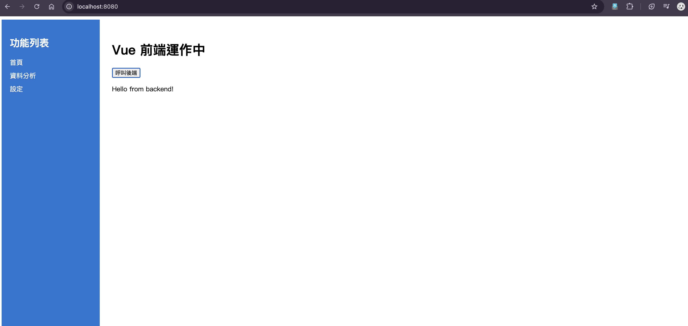

# Vue + Python (Flask) 前後端分離練習專案

## 專案簡介
本專案示範如何用 docker compose 建立一個簡單的前後端分離網站，前端採用 Vue，後端採用 Python Flask，並以 Nginx 反向代理 API 請求。

## 專案結構
```
vue-implemnet/
├── backend/           # Python Flask API
│   ├── app.py
│   ├── requirements.txt
│   └── Dockerfile
├── frontend/          # Vue 前端 (靜態檔案 + Nginx)
│   ├── index.html
│   ├── main.js
│   ├── nginx.conf
│   └── Dockerfile
├── docker-compose.yml # docker compose 設定
└── README.md
```

## 網站示意



## 啟動方式

1. 進入專案根目錄
2. 若有修改 frontend 檔案，請先重建 image，確保最新內容被打包：
   ```bash
   docker compose -f vue-implemnet/docker-compose.yml build --no-cache
   ```
3. 啟動服務（需安裝好 Docker 與 Docker Compose）：
   ```bash
   docker compose -f vue-implemnet/docker-compose.yml up -d
   ```
4. 在瀏覽器輸入 [http://localhost:8080](http://localhost:8080) 開啟前端頁面（建議用 open http://localhost:8080 可自動開啟）


## 服務說明

- **frontend**: 以 Nginx 提供靜態 Vue 頁面，並將 `/api` 請求 proxy 到 backend
- **backend**: Flask 提供 `/api/hello` API，回傳 JSON

## API 測試

- 開啟 [http://localhost:8080](http://localhost:8080)
- 點擊按鈕會呼叫 `/api/hello`，顯示後端回應

## 主要練習重點

- 前後端分離專案結構
- Dockerfile 與 docker compose 實作
- Nginx 反向代理 API
- Vue 與 Flask 基本整合
